# О приложении

Приложение "RunTracker" предназначено для трекинга беговых тренировок.

---

# Возможности приложения

### 1. Логин/регистрация пользователя:

* Осуществление авторизации пользователя по логину и паролю
* Возможность зарегистрироваться новым пользователям, указав основную информацию

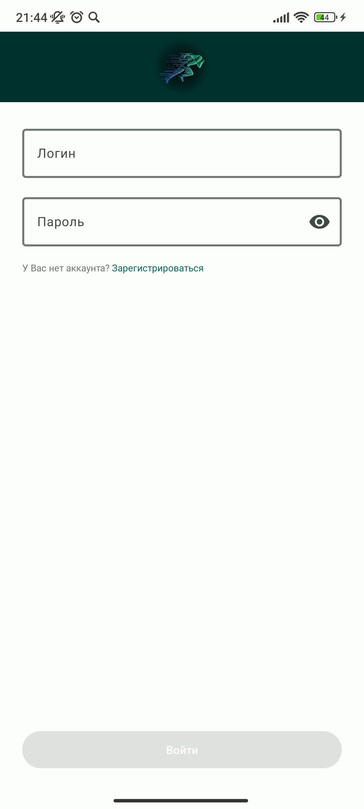
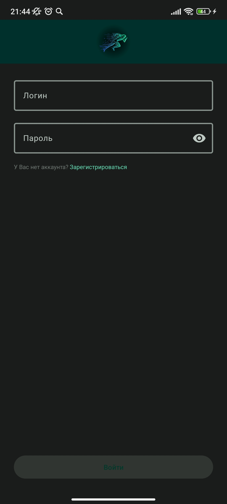

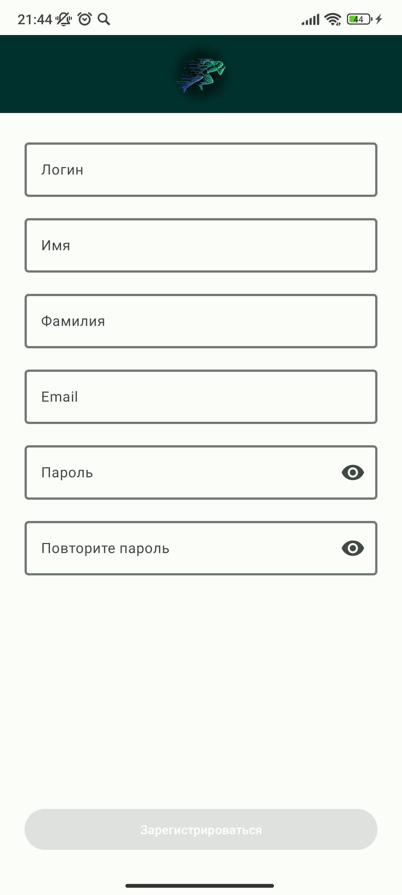
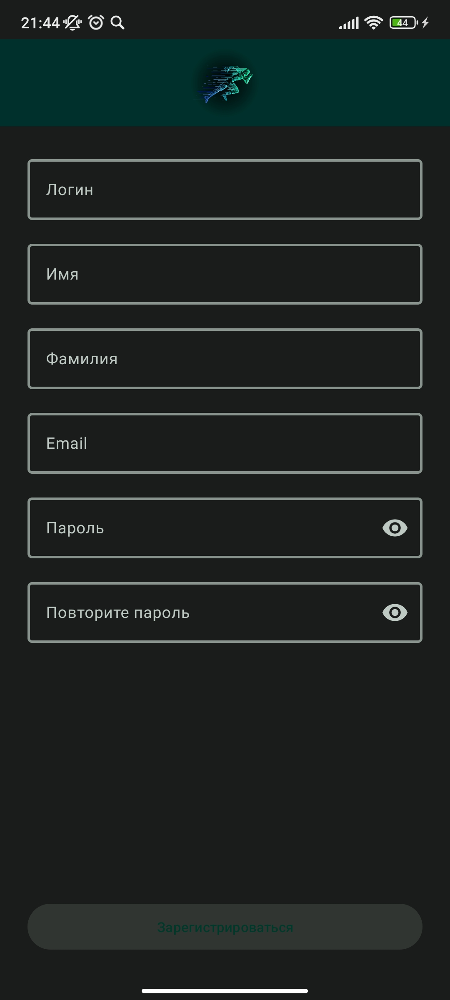

### 2. История тренировок:

* Отображение списка с историей беговых тренировок с указанием основной информации: расстояние,
  время, калории
* Возможность увеличить элемента списка для более детального показа трека тренировки

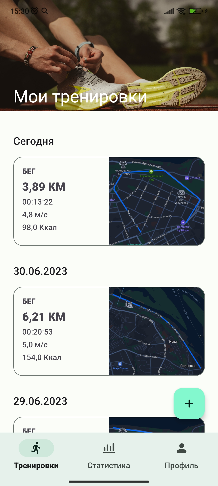
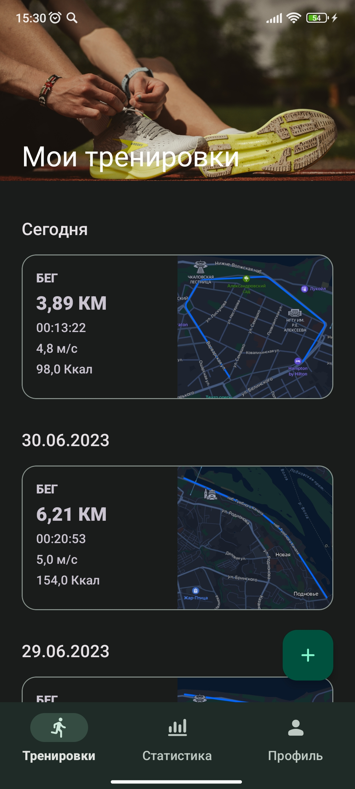

### 3. Добавление новой тренировки:

* Возможность начать новую беговую тренировку
* При необходимости начатую тренировку можно приостановить или закончить
* Отображение уведомления о текущей тренировки

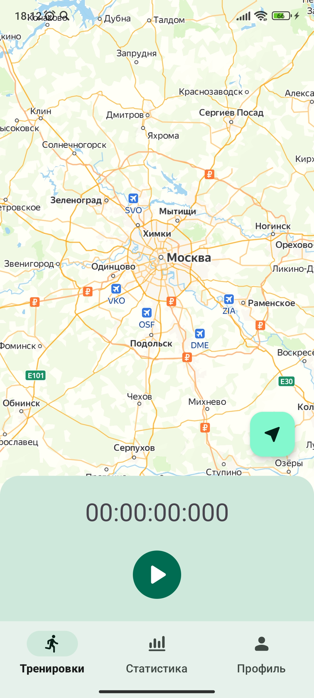
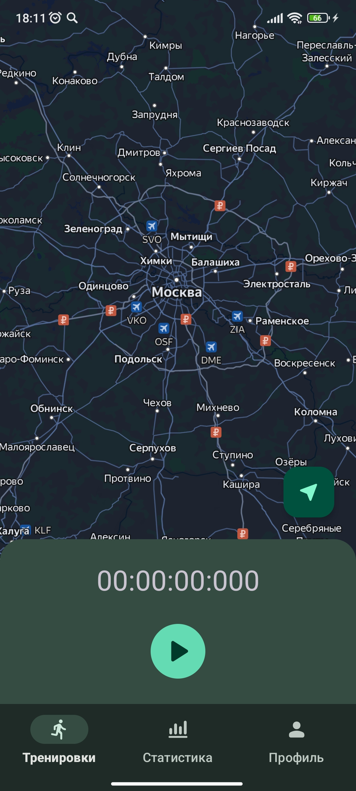

### 4. Отображение статистики тренировок:

* Просмотр статистики пройденного расстояния
* Просмотр статистики потраченных калорий
* Просмотр статистики средней скорости
* Отображение перечисленных характеристик, а также их средних показателей за определенный промежуток
  времени (последняя неделя, 1 месяц или 3 месяца)

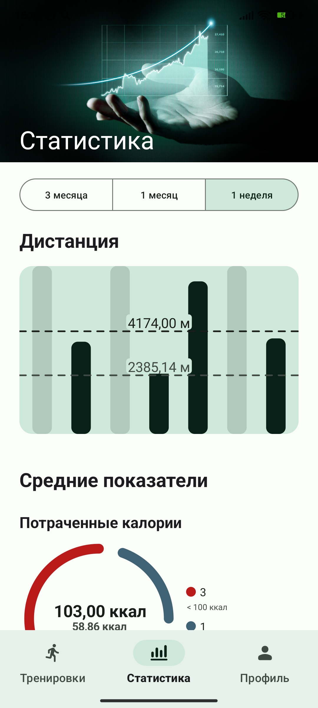
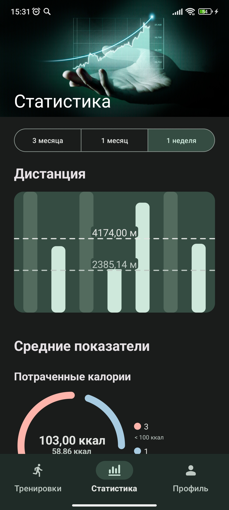

### 5. Профиль пользователя:

* Отображение основной информации о пользователе
* Возможность обновить аватар пользователя
* Возможность выбрать тему приложения (светлая, темная или как в системе)
* Просмотр активных сессий с возможностью удалить определенные сессии
* Возможность выйти из профиля

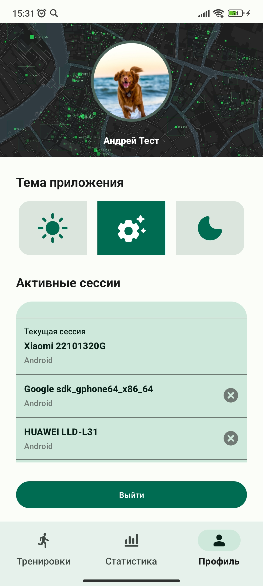
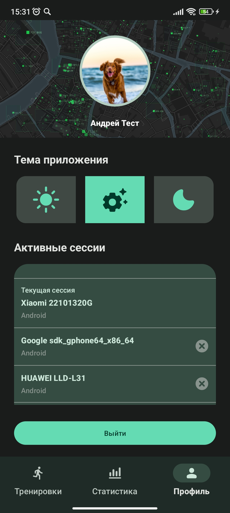

---

# Основной стек технологий

* Kotlin + Coroutines + Flow
* Clean Architecture + MVI
* Multimodule Gradle Project
* Material 3
* DI - Dagger 2
* Network - OkHttp + Retrofit
* Database - Room Persistence Library
* Remote storage - Firebase storage
* Image display - Coil
* Unit testing - JUnit, Mockito, Robolectric
* UI testing - Espresso

---

### Структура Gradle-модулей

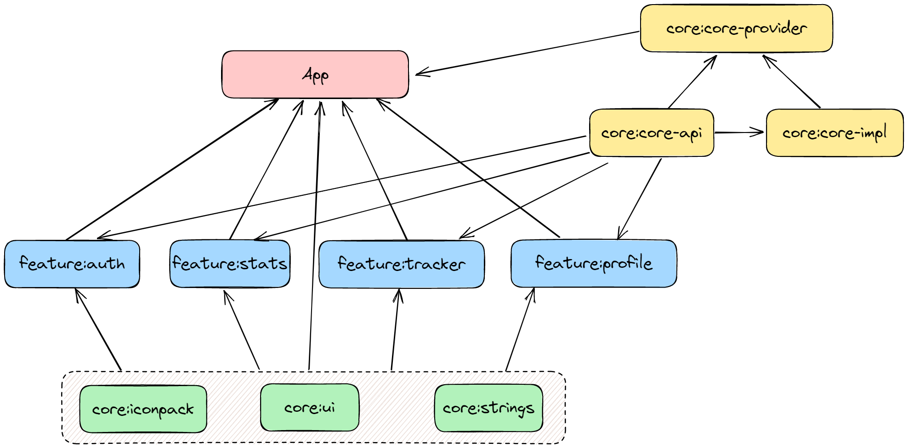

### Структура Dagger-компонентов

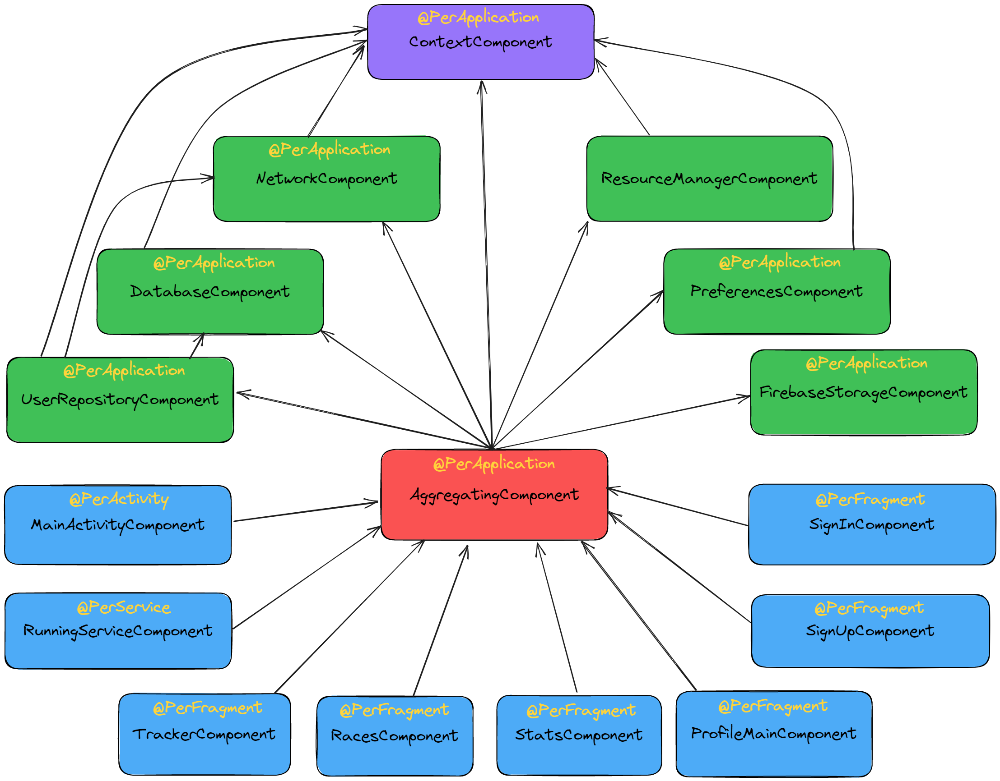

---

Logo image by pikisuperstar on [Freepik](https://www.freepik.com/free-vector/abstract-runner-silhouette-flat-design_4927829.htm#query=run%20logo&position=18&from_view=search&track=ais)

Image on profile screen by GarryKillian on [Freepik](https://ru.freepik.com/free-vector/map-of-big-data-in-modern-city_8289177.htm#query=street%20map&position=13&from_view=search&track=ais)